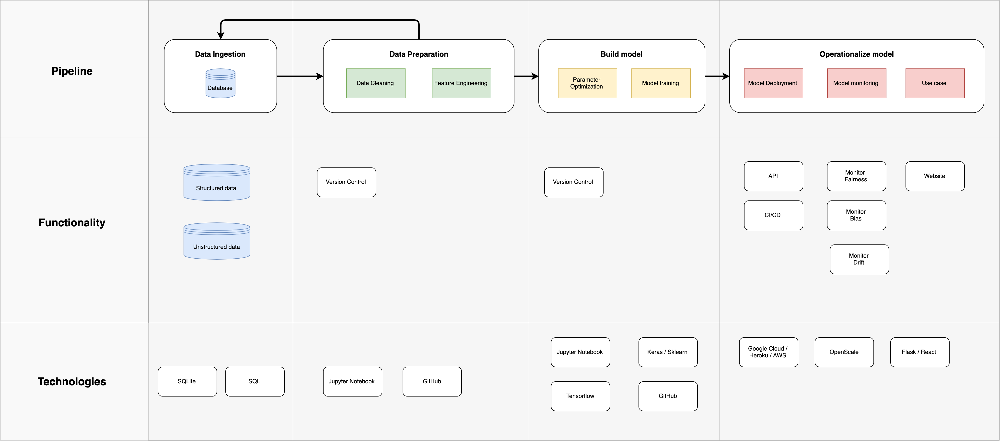

# Machine Learning Pipeline
An experiment to create a simple Machine Learning pipeline following the principle of MVPs(Minimum Viable Product).

## Criteria
The pipeline has to run using free open source technologies.

## Diagram
This diagram describes the overall flow of the pipeline and is very much a work in progress.

  

