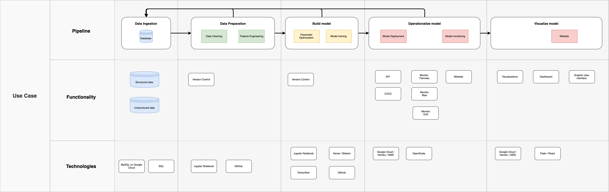

# Machine Learning Pipeline
An experiment to create a simple Machine Learning pipeline following the principle of MVPs(Minimum Viable Product).

## Criteria
The pipeline has to run using free open source technologies.

## Use-case
Operationalizing the Kaggle House Prices found here: https://www.kaggle.com/c/house-prices-advanced-regression-techniques.

Imagine that a real-estate broker or governmental body needs to monitor the accuracy of pricing on houses being put up for sale. This pipeline would allow iterative development of a solution that lets the product owner predict, test and monitor their own performance over time.

## Diagram
This diagram describes the overall flow of the pipeline and is very much a work in progress.

  

## Adding data to database
https://cloud.google.com/sql/docs/mysql/import-export/importing

## Progress
- [x] Add data to database
- [ ] Connect to database from Python script
